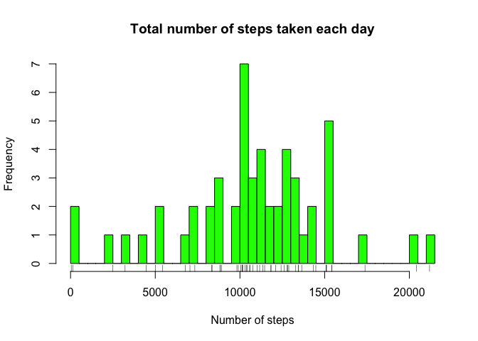
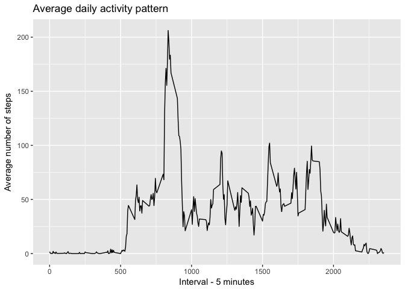
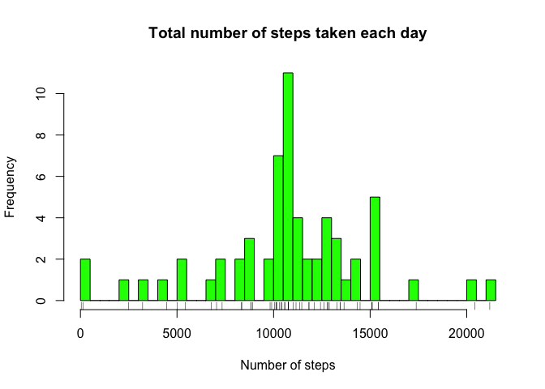
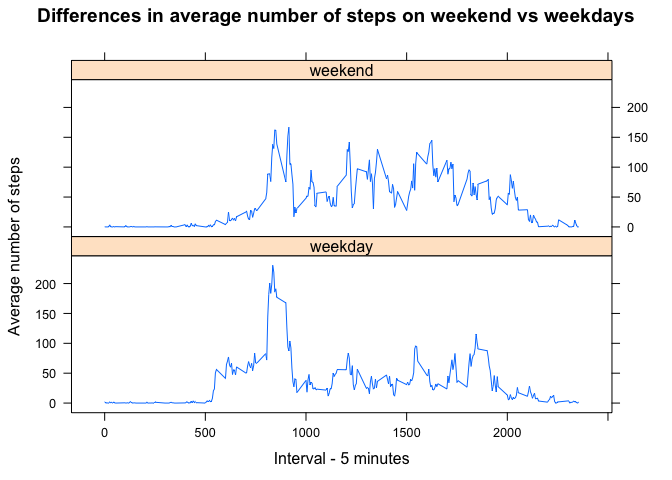

# Coursera_Reproducible_Reasearch_Project
Lukasz Sadalski  
17 03 2017  


## Project

This is assignment from week 2 of Reproducible Research Coursera course.

### Loading data and preprocessing


```r
library(dplyr)
library(ggplot2)
library(timeDate)
library(lattice)
```


```r
setwd("/Users/lsadalski/Desktop/R/Coursera_Assignment_Report_knitr/RepData_PeerAssessment1")
file <- unzip ("activity.zip")
raw_data <- read.csv("activity.csv")
# str(rdata)
# head(rdata)
# tail(rdata)

raw_data$date <- as.Date(raw_data$date)
```

### What is mean total number of steps taken per day?


```r
group_data <- group_by (raw_data, date)
group_sum <- summarise(group_data, sum(steps))
steps <- group_sum$`sum(steps)`
hist (steps, breaks=50, col="green", main = "Total number of steps taken each day", xlab = "Number of steps")
rug(steps)
```

<!-- -->

```r
meansteps <- mean (steps, na.rm = T)
meansteps
```

```
## [1] 10766.19
```

```r
mediansteps <- median (steps, na.rm = T)
mediansteps
```

```
## [1] 10765
```

The mean steps per day is 10766.1886792453
The median steps per day is 10765 

### What is the average daily activity pattern?


```r
agg_data <- aggregate (raw_data$steps, by = list(raw_data$interval), FUN="mean", na.rm = TRUE)
colnames (agg_data) <- c("interval","average_steps")
ggplot (data=agg_data, aes(x=interval, y=average_steps)) +
  geom_line () +
  xlab ("Interval - 5 minutes") +
  ylab ("Average number of steps") +
  ggtitle ("Average daily activity pattern")
```

<!-- -->

Which interval on average across all the days contains maximum number of steps?


```r
which_interval <- which.max(agg_data$average_steps)
max_interval <- agg_data[which_interval,1]
max_interval
```

```
## [1] 835
```

```r
max_steps <- agg_data[which_interval,2]
max_steps
```

```
## [1] 206.1698
```

Maximum number of steps is contained in 835 interval, there was 206.1698113 steps

### Imputing missing values

1. Calculating total number of missing values in the dataset


```r
sum(is.na(raw_data$steps))
```

```
## [1] 2304
```

Total number of missing values for steps is 2304

2. Strategy for missing values 

I will replace NA with mean of this 5-minute interval 

3. Creating new data set and replacing NAs


```r
imputed_data <- raw_data

for (i in 1:length(imputed_data[, 1])){
    if (is.na(imputed_data[i,1]))
        {  which_interval <- imputed_data[i,3]
           indeks <- which(agg_data$interval == which_interval)
           imputed_data[i,1]<-agg_data[indeks, 2]}
}
```

4. What is mean total number of steps taken per day for imputed data? 


```r
group_data <- group_by (imputed_data, date)
group_sum <- summarise(group_data, sum(steps))
steps <- group_sum$`sum(steps)`
hist (steps, breaks=50, col="green", main = "Total number of steps taken each day", xlab = "Number of steps")
rug(steps)
```

<!-- -->

```r
i_meansteps <- mean (steps, na.rm = T)
i_meansteps
```

```
## [1] 10766.19
```

```r
i_mediansteps <- median (steps, na.rm = T)
i_mediansteps
```

```
## [1] 10766.19
```

The mean steps per day is 10766.1886792453
The median steps per day is 10766.1886792453 

The difference between mean and median for raw and imputed data set (NAs replaced by mean) is for median only.
It was 10765 and now it is 10766.1886792453

### Are there differences in activity patterns between weekdays and weekends?


```r
imputed_data <- mutate (imputed_data,isWeekday(date))
imputed_data$`isWeekday(date)` <- gsub("TRUE","weekday",imputed_data$`isWeekday(date)`)
imputed_data$`isWeekday(date)` <- gsub("FALSE","weekend",imputed_data$`isWeekday(date)`)
imputed_data$`isWeekday(date)` <- as.factor(imputed_data$`isWeekday(date)`)
colnames (imputed_data) <- c("steps","date","interval","weekend_weekday")

agg2_data <- aggregate (imputed_data$steps, by = list(imputed_data$interval, imputed_data$weekend_weekday), FUN="mean", na.rm = TRUE)
colnames (agg2_data) <- c("interval","weekend_weekday","steps")
xyplot(steps~interval|weekend_weekday, agg2_data,type="l",layout=c(1,2), xlab="Interval - 5 minutes", ylab="Average number of steps", main = "Differences in average number of steps on weekend vs weekdays")
```

<!-- -->
